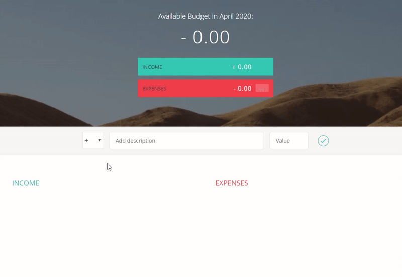

Description: Application made to track your monthly budget. You can enter incomes and expenses which go to separate collumns and on the top you can see your calculated total budget for particular month.

Techonologies used: Javascript (ES5), Html, Css.

How to start: run "index.html" file.